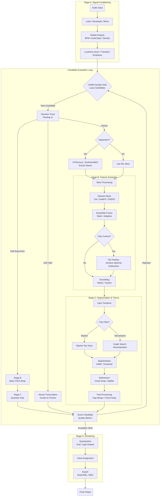

# Pipeline Workflow & Contracts (MNC v2.0)

This document outlines the detailed call graph, data flow, algorithms, and configuration triggers for the music transcription pipeline (Stages A-D).

## Detailed Pipeline Flowchart

This chart details the end-to-end flow, including Signal Conditioning, the Unified Quality Gate loop, Routing Logic, Source Separation, Polyphonic Processing, and Rendering.



## Flowchart Explainer

### Stage A: Preprocessing
*   **Signal Conditioning**: The input audio is resampled to a consistent rate (44.1kHz or 22.05kHz), mixed to mono, and trimmed of silence.
    *   **Transient Emphasis**: Optional whitening filter (warped linear prediction, alpha ~0.97) to enhance attacks (e.g., piano/drums).
*   **Normalization**: Loudness is normalized to a target (e.g., -23 LUFS) to ensure consistent detector response.
*   **Global Analysis**:
    *   **BPM Detection**: `librosa.beat.beat_track` with clamping/octave correction.
    *   **Texture Detection**: Heuristics classify audio as Monophonic, Polyphonic, or Poly-Dominant (`AudioType`).

### Unified Quality Gate (Candidate Loop)
The pipeline employs a "Unified Quality Gate" in `transcribe.py` that iterates through a list of candidate strategies (e.g., `e2e_onsets_frames`, `classic_piano_poly`, `classic_melody`) until one passes quality thresholds.
*   **Scoring**: Each candidate result is scored based on `voiced_ratio`, `note_count`, `notes_per_sec` (density), and fragmentation.
*   **Fallback**: If a candidate (e.g., E2E) fails or produces low-quality output, the system falls back to the next strategy (e.g., Classic).

### Stage B: Feature Extraction
*   **Decision Trace (Routing v1)**:
    *   Evaluates input features (density, mixture score) to deterministically resolve `transcription_mode` ("classic", "e2e", "auto") and parameters.
*   **E2E Paths**:
    *   **Onsets & Frames**: Bypass Stage B/C core logic; calls neural model directly.
    *   **Basic Pitch**: Wraps the neural model in Stage B to produce "precalculated notes", which then flow through Stage C for quantization.
*   **Source Separation (Classic)**:
    *   **HTDemucs**: Neural separation for vocals/bass/drums.
    *   **SyntheticMDX**: Fast, template-based separation for L2 benchmarks.
*   **Detector Bank**: Up to six algorithms run in parallel (YIN, SwiftF0, CREPE, etc.).
*   **Ensemble Fusion**:
    *   **Static**: Traditional weighted averaging.
    *   **Adaptive**: Reliability-gated weighted median (robust against outliers; penalizes unstable detectors).
*   **Polyphony (ISS)**: **Iterative Spectral Subtraction** peels accompaniment voices using frequency-aware masking and adaptive strength.
*   **Smoothing**:
    *   **Tracker**: Hungarian assignment for voice continuity.
    *   **Viterbi**: HMM-based pathfinding for optimal global pitch contour.

### Stage C: Segmentation & Theory
*   **Stem Selection**: Picks the best stem (e.g., Vocals vs Mix) based on voiced coverage and confidence.
*   **Polyphony Filter**:
    *   **Skyline Top Voice**: Biases selection towards the vocal range (80-1400Hz) and continuity.
    *   **Decomposed Melody**: Fully decomposes polyphony and picks the strongest track (L5 optimization).
*   **Segmentation**: Converts frame-wise pitch probability to note events using HMM or Threshold logic.
*   **Refinement**:
    *   **Onset Snapping (`snap_onset`)**: Aligns note starts to local peaks in spectral flux (onset strength).
    *   **Repeated Note Splitter**: Detects re-articulations (energy bumps) within sustained pitch segments.
*   **Post-Processing**:
    *   **Gap Merging**: Bridges micro-gaps (<60ms) in legato phrases (prioritizes `post_merge.max_gap_ms`).
    *   **Chord Snapping**: Aligns nearly-simultaneous onsets to form clean chords.

### Stage D: Quantization & Rendering
*   **Quantization**:
    *   **Grid Mode**: Hard snap to nearest grid unit (e.g., 1/16th).
    *   **Light Rubato**: Snaps only notes close to the grid (within ~30ms), preserving expressive timing elsewhere.
*   **Voice Assignment**:
    *   Groups events by (Staff, Voice). Defaults to Treble/Bass split at C4 (MIDI 60).
*   **Glissando Detection**:
    *   Identifies sequential notes with small pitch gaps and short time intervals to insert `music21.spanner.Glissando`.
*   **Rendering**: Formats notes into MusicXML (Grand Staff layout with braces) and MIDI.

## Tunable Parameters (Tuner/Audit)

The following parameters are exposed for iterative tuning and audit verification.

### Stage A: Conditioning
*   `target_sample_rate`: Working sample rate (default 44100Hz, or 22050Hz for piano).
*   `transient_pre_emphasis`: Enable/disable attack enhancement.
*   `high_pass_filter.cutoff_hz`: HPF cutoff (20-60Hz).
*   `bpm_detection`: `min_bpm`, `max_bpm` clamps.
*   `peak_limiter.mode`: "soft" or "hard" clipping.

### Stage B: Features
*   **Routing**:
    *   `transcription_mode`: "classic", "e2e_basic_pitch", "auto".
    *   `active_stems`: Whitelist of stems (e.g. `["vocals", "bass"]`).
*   **Separation**:
    *   `separation.enabled`: Auto/True/False.
    *   `separation.model`: "htdemucs" or "synthetic" (L2).
    *   `separation.harmonic_masking`: Generate synthetic melody/bass stems via F0 priors.
*   **Detectors**:
    *   `detectors.<name>.enabled`: Toggle SwiftF0, YIN, CREPE, RMVPE, etc.
    *   `ensemble_weights.<name>`: Contribution of each detector.
*   **Fusion & Smoothing**:
    *   `ensemble_mode`: "static" (weighted average) or "adaptive" (reliability-gated).
    *   `smoothing_method`: "tracker" (Hungarian) or "viterbi" (HMM).
*   **Polyphony**:
    *   `polyphonic_peeling.max_layers`: Max voices to extract (ISS).
    *   `polyphonic_peeling.iss_adaptive`: Enable adaptive strength.
    *   `polyphonic_peeling.use_freq_aware_masks`: Wider masks for bass frequencies.

### Stage C: Segmentation
*   **Logic**:
    *   `polyphony_filter.mode`: "skyline_top_voice" (default) or "decomposed_melody".
    *   `confidence_threshold`: Minimum confidence for note activation.
    *   `min_note_duration_ms`: Minimum duration (Mono).
    *   `min_note_duration_ms_poly`: Minimum duration (Poly, default 45ms).
    *   `polyphonic_confidence`: Thresholds for Melody vs Accompaniment.
*   **Refinement**:
    *   `use_onset_refinement`: Snap start times to flux peaks.
    *   `use_repeated_note_splitter`: Split long notes on energy re-articulation.
    *   `chord_onset_snap_ms`: Tolerance for snapping simultaneous notes.
    *   `post_merge.max_gap_ms`: Max gap to bridge for legato (prioritized).
    *   `gap_filling.max_gap_ms`: Legacy gap filling parameter.

### Stage D: Quantization
*   `quantization_mode`: "grid" or "light_rubato".
*   `light_rubato_snap_ms`: Window for snapping in rubato mode (e.g., 30ms).
*   `quantization_grid`: Grid resolution (16 = 1/16th).
*   `forced_key`: Override detected key signature.
*   `glissando_threshold_general`: Config for glissando detection.

---

## Stage A: Load & Preprocess (`backend/pipeline/stage_a.py`)

**Goal:** Normalize audio into a consistent, analysis-ready format and perform initial global analysis.

### Strategies & Algorithms

1.  **Loading & Resampling**: `librosa.load` (fallback to `scipy`). Fixed sample rate (44.1k/22.05k).
2.  **Mono Conversion**: Average channels.
3.  **DC Offset Removal**: `y = y - mean(y)`.
4.  **High-Pass Filter**: Butterworth filter (order 4, ~55Hz) to remove rumble.
5.  **Transient Emphasis**: Warped linear prediction (alpha ~0.97) to whiten spectrum and enhance attacks.
6.  **Peak Limiting**: Optional soft/hard clipping.
7.  **Loudness Normalization**: EBU R128 (via `pyloudnorm`) or RMS gain.
8.  **BPM Detection**: `librosa.beat.beat_track` with clamping/octave correction.
9.  **Texture Detection**: Spectral flatness heuristic to determine `AudioType` (Mono/Poly).

### Output Contract: `StageAOutput`

```python
@dataclass
class StageAOutput:
    stems: Dict[str, Stem]      # "mix" stem always present
    meta: MetaData              # SR, Duration, BPM, Key, AudioType
    audio_type: AudioType       # MONOPHONIC | POLYPHONIC | POLYPHONIC_DOMINANT
    noise_floor_rms: float      # Estimated noise floor
    noise_floor_db: float       # Log noise floor
    beats: List[float]          # Detected beat timestamps (seconds)
    diagnostics: Dict[str, Any] # "bpm_method", "preprocessing_applied", etc.
```

---

## Stage B: Feature Extraction (`backend/pipeline/stage_b.py`)

**Goal:** Extract fundamental frequency (f0) contours, confidence scores, and perform source separation.

### Strategies & Algorithms

1.  **Decision Trace (Routing v1)**:
    *   Evaluates input features (density, mixture score) to deterministically resolve `transcription_mode` ("classic", "e2e", "auto") and parameters.
2.  **Instrument Profile Resolution**:
    *   Applies overrides (e.g., Pre-LPF for distorted guitar, Transient Lockout for percussion).
3.  **Source Separation**:
    *   **HTDemucs**: Neural separation for vocals/bass/drums.
    *   **SyntheticMDX**: Fast, template-based separation for L2 benchmarks.
4.  **Adaptive Fusion (Ensemble)**:
    *   Reliability-gated weighted median. Penalizes detectors with high instability or "octave popping".
5.  **Polyphonic Peeling (ISS)**:
    *   Iterative Spectral Subtraction with **Frequency-Aware Masking** and **Adaptive Strength**.
    *   Extracts up to `max_layers` secondary voices.

### Output Contract: `StageBOutput`

```python
@dataclass
class StageBOutput:
    time_grid: np.ndarray           # Time values for frames
    f0_main: np.ndarray             # Dominant pitch track (Hz)
    f0_layers: List[np.ndarray]     # Polyphonic layers
    stem_timelines: Dict[str, List[FramePitch]] # Per-stem timelines
    per_detector: Dict[str, Any]    # Raw detector outputs
    meta: MetaData                  # Passed through
    diagnostics: Dict[str, Any]     # "decision_trace", "iss", "cqt_gate"
    precalculated_notes: Optional[List[NoteEvent]] # E2E bypass notes
```

---

## Stage C: Theory & Segmentation (`backend/pipeline/stage_c.py`)

**Goal:** Convert continuous frame data into discrete musical `NoteEvents`.

### Strategies & Algorithms

1.  **Skyline Selection**:
    *   **Skyline Top Voice**: Selects best candidate prioritizing Vocal Range (80-1400Hz) and continuity.
    *   **Decomposed Melody**: Fully decomposes polyphony and picks the strongest track (L5 optimization).
2.  **Onset Refinement (`snap_onset`)**:
    *   Aligns note starts to local peaks in spectral flux (onset strength) derived from RMS diffs.
3.  **Repeated Note Splitter**:
    *   Detects re-articulations (energy bumps > threshold) to split sustained pitches.
4.  **Polyphonic Decomposition**:
    *   Greedy cost-based assignment of concurrent pitches to stable voice tracks.
5.  **Post-Processing**:
    *   **Gap Merging**: Bridges micro-gaps (<60ms) in legato phrases.
    *   **Chord Snapping**: Aligns onsets within `chord_onset_snap_ms` (25ms).

### Output Contract: `AnalysisData`

```python
@dataclass
class AnalysisData:
    meta: MetaData
    notes: List[NoteEvent]          # The final list of notes
    stem_timelines: Dict[str, List[FramePitch]]
    beats: List[float]              # Beat grid
    notes_before_quantization: List[NoteEvent] # Raw notes for debugging/scoring
    precalculated_notes: Optional[List[NoteEvent]]
    diagnostics: Dict[str, Any]     # "segmentation_method", "stage_c_post"
```

---

## Stage D: Rendering (`backend/pipeline/stage_d.py`)

**Goal:** Align notes to the musical grid and export standard formats.

### Strategies & Algorithms

1.  **Quantization**:
    *   **Grid Mode**: Hard snap to nearest grid unit.
    *   **Light Rubato**: Snaps only if note is within `light_rubato_snap_ms` of grid; else preserves original timing.
2.  **Voice Assignment**:
    *   Groups events by (Staff, Voice). Defaults to Treble/Bass split at C4 (MIDI 60).
3.  **Glissando Detection**:
    *   Identifies sequential notes with small pitch gaps and short time intervals to insert `music21.spanner.Glissando`.
4.  **Render & Export**:
    *   **MusicXML**: Grand Staff layout with braces.
    *   **MIDI**: Binary export via temp file.

### Output Contract: `TranscriptionResult`

```python
@dataclass
class TranscriptionResult:
    musicxml: str           # Full MusicXML content
    midi_bytes: bytes       # Standard MIDI file content
    analysis_data: AnalysisData # Ref to source data
```
