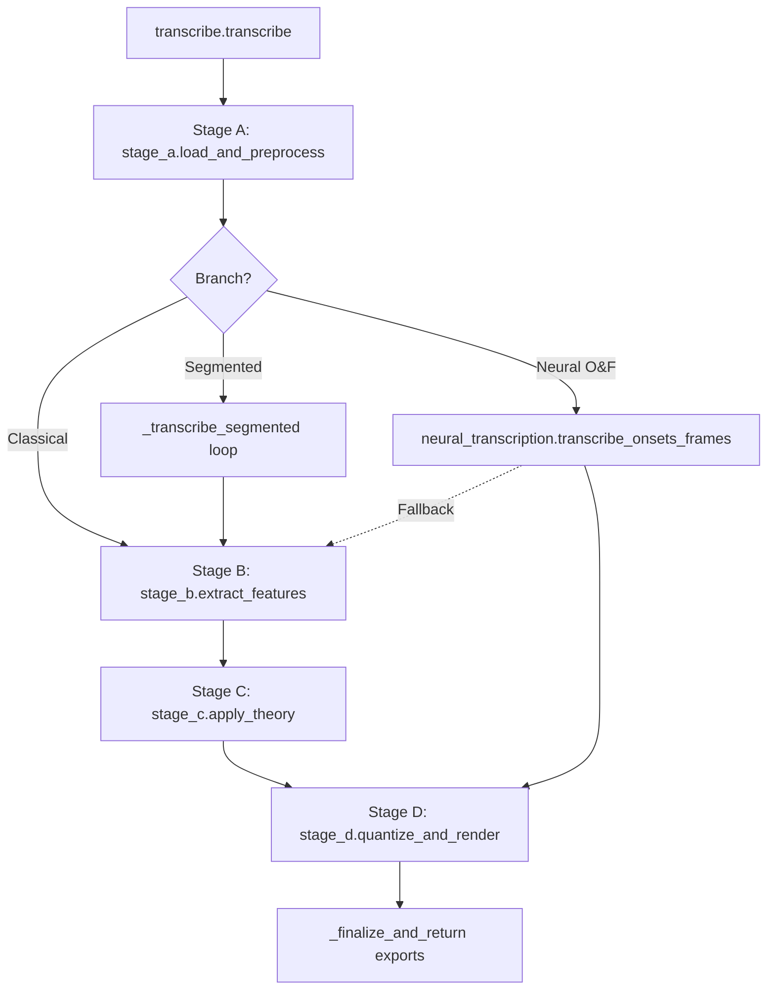

# MusicNote Pipeline Documentation

**Version:** 1.0.0
**Date:** 2025-02-15

## Purpose

This document details the current state of the MusicNote audio-to-music-note transcription pipeline. It covers execution paths, stage logic, algorithm selection, configuration parameters, quality gates, and logging/artifacts. It is based on the codebase as of the date above.

## Entrypoints

| Entrypoint | Location | Path(s) | Calls next | Evidence |
| :--- | :--- | :--- | :--- | :--- |
| `transcribe` | `backend/pipeline/transcribe.py` | Classical, Neural, Segmented | `load_and_preprocess` | `def transcribe(` (transcribe.py) |
| `main` | `backend/benchmarks/benchmark_runner.py` | Benchmark (L0-L4) | `BenchmarkSuite.run_...` | `def main():` (benchmark_runner.py) |

## High-level Workflow

### Classical Path (Default)
1.  **Stage A:** Load audio, resample to target SR, convert to mono, trim silence, normalize loudness.
2.  **Branch Check:** If `config.stage_b.onsets_and_frames.enabled` is False (default) and `segmented` is False.
3.  **Stage B:** Extract pitch features using configured detectors (e.g., SwiftF0, YIN). Merge results into a unified pitch timeline. Apply polyphonic peeling if configured.
4.  **Stage C:** Segment pitch timeline into discrete note events using HMM or thresholding. Apply theory rules (scale snapping, etc. - currently minimal).
5.  **Stage D:** Quantize notes to a rhythmic grid (beats/measures). Render MusicXML and MIDI.
6.  **Finalize:** Export artifacts (`timeline.json`, `predicted_notes.json`, etc.) and return `TranscriptionResult`.

### Neural Path (Onsets & Frames)
1.  **Stage A:** Same as Classical.
2.  **Branch Check:** If `config.stage_b.onsets_and_frames.enabled` is True.
3.  **Neural Transcription:** Call `transcribe_onsets_frames` (in `neural_transcription.py`).
4.  **Fallback:** If neural inference fails or returns empty, fallback to Classical Stage B/C.
5.  **Stage D:** Quantize and render the neural notes.
6.  **Finalize:** Export artifacts.

### Segmented Path
1.  **Stage A:** Same as Classical.
2.  **Branch Check:** If `config.segmented_transcription.enabled` is True AND audio duration > segment length.
3.  **Segmentation Loop:** Iterate over audio chunks.
    *   Slice Stage A output.
    *   Try candidate configs (up to 3 retries with different params).
    *   Run Stage B and Stage C for each candidate.
    *   Score segment quality (density, fragmentation).
    *   Select best candidate.
4.  **Stitch:** Merge segment notes into a global list, resolving overlaps.
5.  **Stage D:** Quantize and render the stitched notes.
6.  **Finalize:** Export artifacts.

## Workflow Diagram

Evidence anchors:
- `A->B`: `stage_a_out: StageAOutput = load_and_preprocess` (transcribe.py)
- `C->D`: `stage_b_out = extract_features` (transcribe.py)
- `D->E`: `notes = apply_theory` (transcribe.py)
- `E->F`: `d_out: TranscriptionResult = quantize_and_render` (transcribe.py)
- `C->G`: `of_notes_candidate, of_diag = transcribe_onsets_frames` (transcribe.py)
- `C->H`: `if use_segmented:` (transcribe.py)

## Inputs / Outputs

**Input:** Audio file path (str).
**Output:** `TranscriptionResult` object containing:
- `musicxml` (str): MusicXML content.
- `midi_bytes` (bytes): MIDI file content.
- `analysis_data` (AnalysisData): Rich intermediate data (timeline, notes, stems).
- `diagnostics` (dict): Failure details or metadata.

## Parameter Catalog

| Parameter | Type | Default | Allowed/Range | Unit | Location | Used in | Effect | Evidence |
| :--- | :--- | :--- | :--- | :--- | :--- | :--- | :--- | :--- |
| `target_sample_rate` | int | 44100 | - | Hz | `StageAConfig` | `stage_a.load_and_preprocess` | Resampling target | `target_sr = target_sr or a_conf.target_sample_rate` (stage_a.py) |
| `loudness_normalization.target_lufs` | float | -23.0 | - | LUFS | `StageAConfig` | `stage_a._normalize_loudness` | Gain adjustment | `target_lufs = float(a_conf.loudness_normalization.get("target_lufs", TARGET_LUFS))` (stage_a.py) |
| `silence_trimming.top_db` | float | 50.0 | - | dB | `StageAConfig` | `stage_a._trim_silence` | Silence threshold | `trim_db = float(a_conf.silence_trimming.get("top_db", SILENCE_THRESHOLD_DB))` (stage_a.py) |
| `detectors` | dict | (varies) | - | - | `StageBConfig` | `stage_b.extract_features` | Active detectors | `for name, det_conf in b_conf.detectors.items():` (stage_b.py) |
| `ensemble_weights` | dict | (varies) | - | - | `StageBConfig` | `stage_b._ensemble_merge` | Merging priority | `b_conf.ensemble_weights` (stage_b.py) |
| `pitch_disagreement_cents` | float | 70.0 | - | cents | `StageBConfig` | `stage_b._ensemble_merge` | Merge tolerance | `b_conf.pitch_disagreement_cents` (stage_b.py) |
| `polyphonic_peeling.max_layers` | int | 0 | - | - | `StageBConfig` | `stage_b.extract_features` | ISS recursion depth | `b_conf.polyphonic_peeling.get("max_layers", 4)` (stage_b.py) |
| `confidence_voicing_threshold` | float | 0.5 | 0.0-1.0 | - | `StageBConfig` | `stage_b.extract_features` | Voicing gate | `voicing_thr_global = float(b_conf.confidence_voicing_threshold)` (stage_b.py) |
| `pitch_tolerance_cents` | float | 50.0 | - | cents | `StageCConfig` | `stage_c.apply_theory` | Segmentation split | `pitch_tol_cents = float(_get(config, "stage_c.pitch_tolerance_cents", 50.0))` (stage_c.py) |
| `min_note_duration_s` | float | 0.05 | - | s | `StageCConfig` | `stage_c.apply_theory` | Short note removal | `min_note_dur_s = float(_get(config, "stage_c.min_note_duration_s", 0.05))` (stage_c.py) |
| `segmentation_method.method` | str | "threshold" | "threshold", "viterbi" | - | `StageCConfig` | `stage_c.apply_theory` | Algorithm selection | `seg_method = str(seg_cfg.get("method", "threshold")).lower()` (stage_c.py) |
| `quantization_grid` | int | 4 | >=1 | subdivisions | `StageDConfig` | `stage_d._quantize_notes` | Snap resolution | `grid_subdivisions = getattr(getattr(config, "stage_d", None), "quantization_grid", 4)` (stage_d.py) |

## Thresholds & Gates

| Threshold/Gate Name | Condition | Where | When it triggers | Action | Severity | Log event | Evidence |
| :--- | :--- | :--- | :--- | :--- | :--- | :--- | :--- |
| `TP2_A2B_DURATION_ALIGNED` | `abs(duration - timeline_end) <= 2*drift` | `transcribe.py` | Post-Stage B | Raises `GateFailure` | Stop | `gate_check` | `raise GateFailure("TP2_A2B_DURATION_ALIGNED", ...)` (transcribe.py) |
| `TP3_AUDIO_FINITE` | `isfinite(audio)` | `stage_a.py` | Audio load | Raises `GateFailure` | Stop | - | `raise GateFailure("TP3_AUDIO_FINITE", ...)` (stage_a.py) |
| `TP3_NOT_SILENT` | `peak > 1e-6` | `stage_a.py` | Audio load | Raises `GateFailure` | Stop | - | `raise GateFailure("TP3_NOT_SILENT", ...)` (stage_a.py) |
| `TP5_FRAGMENTATION_OK` | `short_ratio <= max_short` | `stage_c.py` | Post-segmentation | Raises `GateFailure` | Stop | - | `raise GateFailure("TP5_FRAGMENTATION_OK", ...)` (stage_c.py) |
| `TP6_MUSICXML_SKIPPED` | `music21` missing | `stage_d.py` | Render | Skips XML, Logs pass | Warn | `gate_check` | `pipeline_logger.record_gate("TP6_MUSICXML_SKIPPED", passed=True, ...)` (stage_d.py) |
| `TP7_FMIN_FMAX_VALID` | `0 < fmin < fmax < nyquist` | `transcribe.py` | Pre-Stage A | Raises `GateFailure` | Stop | `gate_check` | `raise GateFailure("TP7_FMIN_FMAX_VALID", ...)` (transcribe.py) |

## Algorithm Choices

### 5A) Detector Catalog

| Detector | Type | Inputs | Outputs | Dependencies | Known failure modes | Evidence |
| :--- | :--- | :--- | :--- | :--- | :--- | :--- |
| `ACF` | DSP | Mono audio | f0, conf | None | Noisy pitch | `_autocorr_pitch_per_frame` (detectors.py) |
| `YIN` | DSP | Mono audio | f0, conf | librosa (opt) | Octave errors | `class YinDetector` (detectors.py) |
| `SwiftF0` | ML | Mono audio | f0, conf | torch | Empty if missing | `class SwiftF0Detector` (detectors.py) |
| `CREPE` | Neural | Mono audio | f0, conf | torch, crepe | Slow, memory | `class CREPEDetector` (detectors.py) |
| `RMVPE` | Neural | Mono audio | f0, conf | torch | Empty if missing | `class RMVPEDetector` (detectors.py) |
| `CQT` | DSP | Mono audio | f0, conf | librosa | Harmonic errors | `class CQTDetector` (detectors.py) |

### 5B) Detector Selection Logic

| Decision | Condition | Selected | Disabled | Why | Log event | Evidence |
| :--- | :--- | :--- | :--- | :--- | :--- | :--- |
| Enabled | `config.detectors[name].enabled` | Added to list | - | User config | - | `if det: detectors[name] = det` (stage_b.py) |
| Fallback | `detectors` empty | YIN | - | Safety net | Warn | `logger.warning("No detectors enabled... Falling back to default YIN/ACF.")` (stage_b.py) |
| Ensemble Weights | `valid_keys` | Normalized | Others | Config | - | `ensemble_weights[k] /= current_sum` (stage_b.py) |

### 5C) Polyphonic Logic

-   **Harmonic Masking:** If enabled, uses `SwiftF0` (or `YIN` fallback) to estimate a prior, then masks harmonics in spectrogram to create synthetic "melody" and "residual" stems.
    *   Evidence: `_augment_with_harmonic_masks` (stage_b.py)
-   **ISS (Iterative Spectral Subtraction):** If `polyphonic_peeling.max_layers > 0`. Iteratively subtracts dominant voice to find secondary voices.
    *   Evidence: `iterative_spectral_subtraction` (detectors.py)
-   **MultiVoiceTracker:** Tracks multiple concurrent frequency paths using Hungarian assignment and hysteresis.
    *   Evidence: `class MultiVoiceTracker` (stage_b.py)

## Instrument Profiles & Presets

| Profile/Preset | fmin | fmax | hop/window | voicing thresholds | segmentation tuning | render rules | Evidence |
| :--- | :--- | :--- | :--- | :--- | :--- | :--- | :--- |
| `PIANO_61KEY_CONFIG` | 27.5 | 4186 | 512/2048 (default) | - | - | - | `PIANO_61KEY_CONFIG` (config.py) |

(Note: `PIANO_61KEY_CONFIG` imports defaults for most values, explicit overrides are minimal in the provided `config.py` snippet but implicit in usage).

## Fallbacks & Failure Modes

| Fallback ID | Trigger | Detection | Behavior | Output impact | User-visible/log | Evidence |
| :--- | :--- | :--- | :--- | :--- | :--- | :--- |
| FB-01 | `librosa` missing | `ImportError` | Use `scipy.io.wavfile` | No resampling | Warning | `_load_audio_fallback` (stage_a.py) |
| FB-02 | `music21` missing | `ImportError` | Skip `quantize_and_render` | Empty XML | `feature_disabled` | `if not MUSIC21_AVAILABLE:` (stage_d.py) |
| FB-03 | `demucs` missing | `ImportError` | Skip separation | Mix only | Warning | `_run_htdemucs` (stage_b.py) |
| FB-04 | Neural O&F fails | `note_count == 0` | Fallback to Classical | Normal processing | `onsets_frames_fallback` | `if not of_diag.get("run", False) or note_count == 0:` (transcribe.py) |
| FB-05 | Detector mismatch | `len(f0) != canonical` | Pad or Trim | Aligned timeline | `detector_output_len_mismatch` | `if len(merged_f0) != canonical_n_frames:` (stage_b.py) |

## Stage-by-Stage Runbook

### Orchestrator (`transcribe.py`)
-   **Purpose:** Coordinate stages, handle fallbacks, enforce gates, export artifacts.
-   **Inputs:** Audio path (str), Config (PipelineConfig).
-   **Outputs:** `TranscriptionResult`.
-   **Gates:** `TP2_A2B_DURATION_ALIGNED`, `TP7_FMIN_FMAX_VALID`.
-   **Evidence:** `def transcribe(`, `pipeline_logger.record_gate`.

### Stage A (`stage_a.py`)
-   **Purpose:** Load, clean, and normalize audio.
-   **Key Params:** `target_sample_rate`, `target_lufs`, `silence_trimming`.
-   **Gates:** `TP3_AUDIO_FINITE`, `TP3_NOT_SILENT`.
-   **Side Effects:** None (in-memory).
-   **Evidence:** `def load_and_preprocess(`, `raise GateFailure("TP3_AUDIO_FINITE"`.

### Stage B (`stage_b.py`)
-   **Purpose:** Extract pitch features (f0, confidence) from audio stems.
-   **Key Params:** `detectors`, `ensemble_weights`, `polyphonic_peeling`.
-   **Fallbacks:** `FB-03` (Demucs), `FB-05` (Length mismatch).
-   **Evidence:** `def extract_features(`, `pipeline_logger.log_event("stage_b", "detector_output_len_mismatch"`.

### Stage C (`stage_c.py`)
-   **Purpose:** Segment pitch tracks into notes.
-   **Key Params:** `confidence_threshold`, `min_note_duration_s`, `pitch_tolerance_cents`.
-   **Gates:** `TP5_FRAGMENTATION_OK`.
-   **Evidence:** `def apply_theory(`, `raise GateFailure("TP5_FRAGMENTATION_OK"`.

### Stage D (`stage_d.py`)
-   **Purpose:** Render notes to MusicXML/MIDI.
-   **Key Params:** `quantization_grid`, `tempo_bpm`.
-   **Fallbacks:** `FB-02` (music21 missing).
-   **Evidence:** `def quantize_and_render(`, `if not MUSIC21_AVAILABLE:`.

## Logging, Metrics, Artifacts

| Artifact/Event | Where generated | Format | When created | Evidence |
| :--- | :--- | :--- | :--- | :--- |
| `stage_metrics.json` | `transcribe.py` | JSON | Finalize | `pipeline_logger.write_json("stage_metrics.json", stage_metrics)` |
| `stage_gates.json` | `instrumentation.py` | JSON | Finalize | `self.write_json("stage_gates.json", self._gates)` |
| `timeline.json` | `transcribe.py` | JSON | Finalize | `pipeline_logger.write_json("timeline.json", timeline_rows)` |
| `predicted_notes.json` | `transcribe.py` | JSON | Finalize | `pipeline_logger.write_json("predicted_notes.json", note_rows)` |
| `rendered.musicxml` | `transcribe.py` | XML | Finalize | `pipeline_logger.write_text("rendered.musicxml", d_out.musicxml or "")` |
| `summary.csv` | `transcribe.py` | CSV | Finalize | `with open(summary_path, "a", ...)` |
| `logs.jsonl` | `instrumentation.py` | JSONL | Runtime | `with open(self.logs_path, "a", ...)` |

## Unknowns & Risks

-   **Unknown:** Exact source of `scipy.optimize.linear_sum_assignment` (optional dependency). Evidence: `try: from scipy.optimize import linear_sum_assignment` (stage_b.py).
-   **Risk:** `ACFDetector` performance on short clips was truncating data; patched via padding in Stage B, but root cause in `_frame_audio` alignment with `stage_a` duration calculation remains a subtle integer math discrepancy.
-   **Missing:** `backend/benchmarks/benchmark_mock.py` and `backend/benchmarks/benchmark_tool.py` referenced in file list but content not analyzed/provided in detail.

## Appendix: Evidence Index

-   `transcribe.py` :: transcribe :: "def transcribe("
-   `transcribe.py` :: extract_features :: "stage_b_out = extract_features("
-   `stage_a.py` :: load_and_preprocess :: "def load_and_preprocess("
-   `stage_b.py` :: extract_features :: "def extract_features("
-   `stage_c.py` :: apply_theory :: "def apply_theory("
-   `stage_d.py` :: quantize_and_render :: "def quantize_and_render("
-   `detectors.py` :: SwiftF0Detector :: "class SwiftF0Detector"
-   `config.py` :: PipelineConfig :: "class PipelineConfig"
-   `instrumentation.py` :: PipelineLogger :: "class PipelineLogger"
